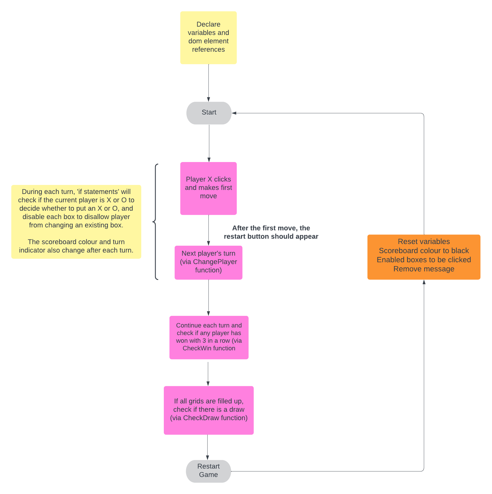

# Tic-Tac-Toe Game
Welcome to my Tic-Tac-Toe game! 
##### Click here to play - https://christianleong.github.io/tic-tac-toe/

## About
Tic-tac-toe is a simple turn based strategy game where 2 players, X and O, take turns marking spaces on a 3 x 3 grid. The first player to place 3 of their marks in a horizontal, vertical, or diagonal line is the winner. 

## How it looks

## Planning & Problem Solving
#### Problem-solving methodology
1. Basic Planning
    - Mark each grid in each row with a number starting from 0 and ending with 8 to represent the index of each grid. (e.g. row 1 will have 0, 1, 2).
    - List the possible win combinations based on the grid numbers from step 1.
    - Develop a logic to test if the player has won.
        - In this game, check if the player's selected boxes match any of the win combination.
2. Sketch the Game Board
    - Play some Tic-Tac-Toe games for some inspiration on how you would like the game to look like.
    - Sketch it out on a piece of paper.
3. Build a Skeleton Board
    - Use HTML and CSS to display how you would like the game to look like.
    - Apply minimal CSS to ensure HTML elements are in the right place.
4. Start Working on Javascript
    - Cache all DOM element references (anything that will be updated on the screen)
    - Declare the variables
5. Add Event Listeners
    - For the purpose of the game, they will 'listen' for any click, specifically on the boxes and restart button.
6. Add Event Handlers
    - These are functions that are on 'stand-by' and will be executed when the event listeners are activated by the click.
    - Start with the simplest function to handle the player's click and replace the empty box with an X or O.
7. Continue with Other Functions
    - e.g. change players, disable boxes, etc.
8. Check for Win and Draw
    - Create a function to check for a win each turn.
        - create a for loop to check each win combination against the filled up boxes (I've added the Xs and Os into an array).
    - If all three boxes are filled up with either X or O and matches the indexes of the win combination, then declare the winner and end the game.
    - Otherwise, create a function to check for a draw if the board is full and there is no winner.
9. Restart the Game
    - Create a function to reset the game and any necessary variables.
10. Testing and retesting
    - Continuosly test the game to find ways to improve it.
10. Update CSS Styling
11. Add additional features
    - e.g. Animation, sound effects, gifs, etc.
12. Optimisation
    - Review the code and find ways to make it more readable (e.g. limit repetition by creating a function, remove unnecessary lines and update the wording of varaibles and functions).

#### Doodles/planning
 

#### Flow charts of app logic

## Resouces
#### Programming languages
- HTML
- CSS
- JavaScript

#### Animations
https://animista.net/
- added some animation to the Game Title and Board for a cool entrance effect.

#### Other resources
https://colorhunt.co/
- used this site for some inspiration on color palettes

https://fonts.google.com/
- added some interesting and free fonts 

https://freesound.org/
- added some sound effects from this site

## Bugs to fix
The board should be stationary instead of shifting up when a player wins and down when the game resets.
Clean up/simplify the code for better readability (if possible).

## Lessons learnt
- Start somewhere, don't focus on perfection on the first go.
- Try to code it on your own, then look for 'inspiration' in other projects online.

## Ideas
- Strike through the winning boxes.
    - Add sound effect when striking through.
- Add a cool/fun theme.
- Add animation to restart game when it appears.
- Add animation to X and O when they appear on the board.
- Maybe add some shadows to give a 3D effect.