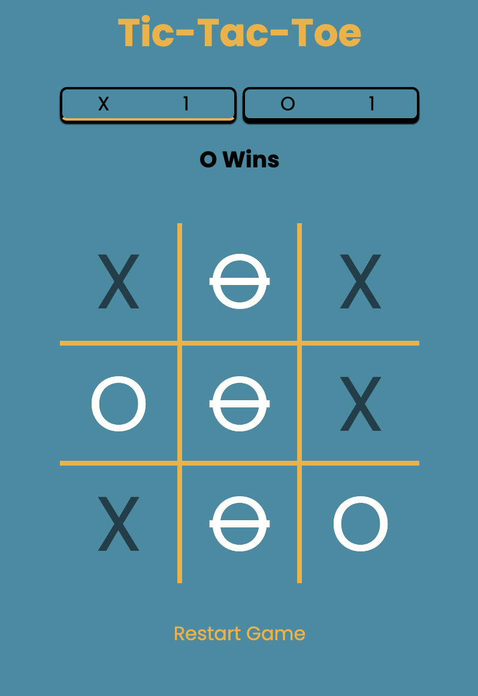
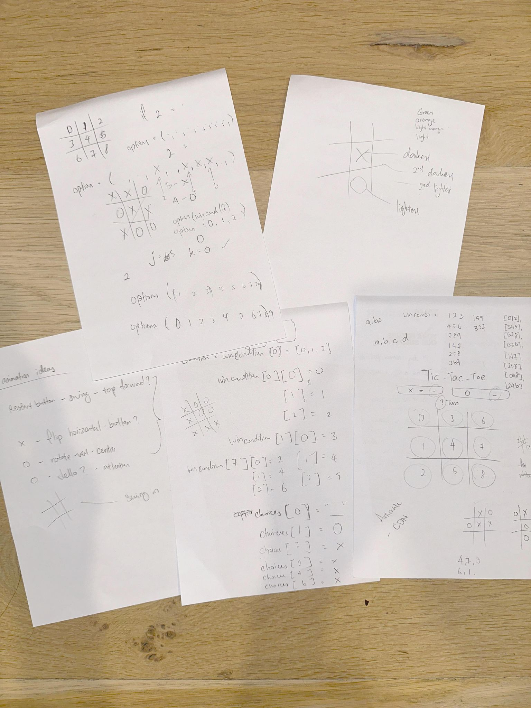

#Tic-Tac-Toe-Game
Welcome to my Tic-Tac-Toe game! 
#####click here to play - https://christianleong.github.io/tic-tac-toe/

##About
Tic-tac-toe is a simple turn based strategy game where 2 players, X and O, take turns marking spaces on a 3 x 3 grid. The first player to place 3 of their marks in a horizontal, vertical, or diagonal line is the winner. 

##How it looks

##Planning & Problem Solving
####Problem-solving methodology

####Doodles/planning
 

####Flow charts of app logic

##Resouces
####Programming languages
- HTML
- CSS
- JavaScript

####Animations
https://animista.net/
- added some animation to the Game Title and Board for a cool entrance effect.

####Other resources
https://colorhunt.co/
- used this site for some inspiration on color palettes

https://fonts.google.com/
- added some interesting and free fonts 

https://freesound.org/
- added some sound effects from this site

##Bugs to fix
The board should be stationary instead of shifting up when a player wins and down when the game resets.

##Lessons learnt
Firstly, I tried to work out the solution 

##Ideas
- Strike through the winning boxes
    - Add sound effect when striking through
- Clone and add a cool/fun theme
- Add animation to restart game when it appears
- Add animation to X and O when they appear on the board

